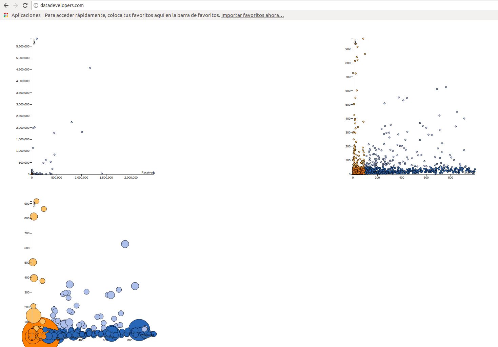

# Segmentacion de mercado con machine learning
Presentacion
https://docs.google.com/presentation/d/1IK83ViTiV66Ev1qU0HvH1MIL-YZMYXz71Fk6JEK8v_g/edit?usp=sharing

Utilizacion de kmeans machine learning y randomforest para clasificar trafico
https://github.com/juanunam/ciscoproyect/blob/master/Propuesta%20de%20funcionamiento%20de%20modelo.ipynb

El notebook principal es el siguiente
https://github.com/juanunam/ciscoproyect/blob/master/Propuesta%20de%20funcionamiento%20de%20modelo.ipynb

Se debe de correr en un ambiente Jupyter con Pandas y ScikitLearn de Python
Una sugerencia es usar el dockerf

Modelo persistido:
model.persisted

Herramienta para correr notebook
sudo docker run -v /data:/data -v ~/:/home/jovyan/work -p 8888:8888 jupyter/all-spark-notebook

Herramienta para probar applicacion

LAMP

